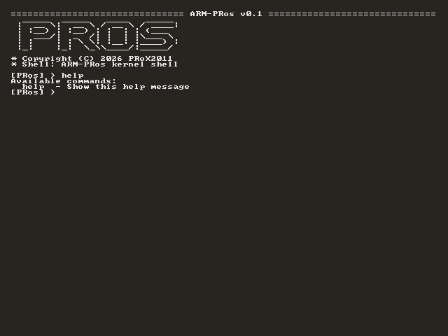

<div align="center">

<h1>ARM-PRos Operating System</h1>

[](LICENSE.TXT)
[](docs/changes/v0.1.txt)

[](https://github.com/PRoX2011/ARM-PRos/stargazers)
[](https://github.com/PRoX2011/ARM-PRos/commits)
[](CONTRIBUTING.md)


**A minimalistic 64-bit operating system written in C and Assembly for ARMv8-A architecture**



</div>

## Overview

**ARM-PRos** is my experimental operating system project for the ARMv8-A architecture. It's practically bare bones right now, but if I find the strength to develop this project further, I'll try to turn it into something more. 

## Roadmap

- [x] UART Driver: Basic text output (puts, puthex, putc)
- [X] UART Input
- [X] String Library (`strcmp`, `strlen`, `atoi`)
- [X] Kernel Shell
- [X] Framebuffer
- [ ] Interrupt Controller (GIC)
- [ ] Keyboard Driver
- [ ] Timer Driver
- [ ] Physical Memory Manager
- [ ] PCI Scanning
- [ ] FAT32 file system
- [ ] *.ELF programs
- [ ] Multitasking

## Building from Source

Install `aarch64-linux-gnu-gcc` (or `clang` if you wanna use `dcr`) compiler using your package manager, then run build script:

```bash
chmod +x build-linux.sh
./build-linux.sh
```

Or use [dcr](https://dcr.dexoron.su)

```bash
dcr build
```

## Runing ARM-PRos

Install `qemu-system-aarch64` emulator then run this command:

```bash
./run-linux.sh
```

Or manually:

```bash
qemu-system-aarch64 \
    -M raspi3b \
    -drive file="$SD_IMG",format=raw,if=sd,index=0 \
    -kernel "$KERNEL_IMG" \
    -serial stdio \
    -display gtk
```

Or use [dcr](https://dcr.dexoron.su)

```bash
dcr run
```

<div align="center">

**Made with ❤️ by PRoX**

</div>